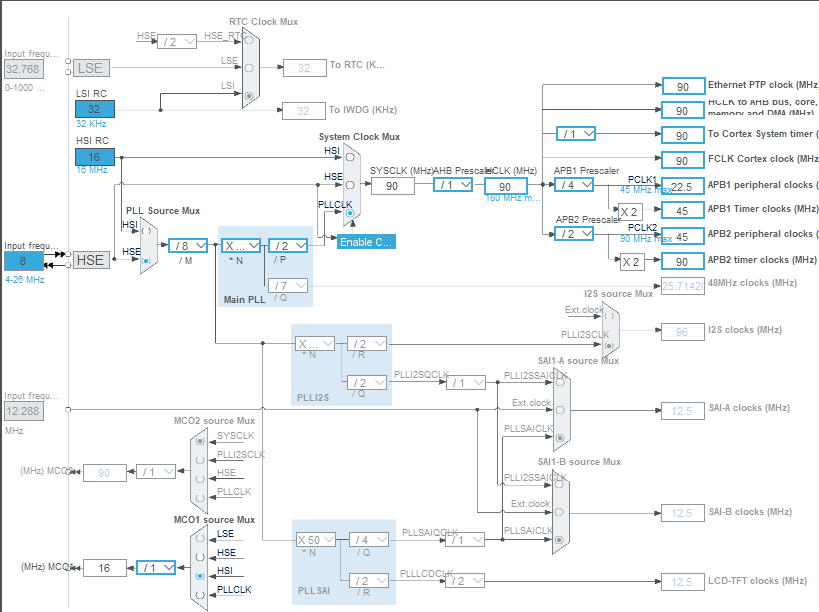
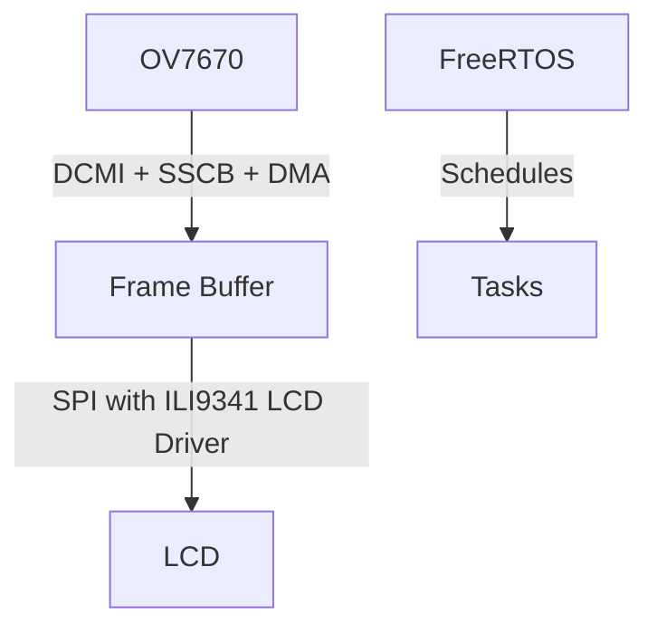

# Project Details

This project is proposed in accordance with the ELE529E Lecture at Istanbul Technical University.

## 1. Introduction

This project investigates real-time image processing using FreeRTOS on STM32F429I Discovery Board. The board features a built-in LCD and supports DCMI, making it ideal for interfacing with external cameras such as the OV7670. Applications of such embedded vision systems include industrial automation, surveillance, and portable diagnostics.

## 2. System Architecture

The system consists of a camera input, memory buffering using DMA, and LCD output. The architecture uses:

- **OV7670** camera module connected via DCMI and SCCB
- **DMA** for efficient memory transfer
- **Frame buffer** in RAM or SDRAM
- **SPI** for driving the onboard LCD
- **FreeRTOS** for managing concurrent tasks

### Clock Configuration
Here, in the clock configuration, HSE (external oscillator) is enabled and PLL scalers are set to their maximum allowable values.
 

### Interfaces

- I2C1 is configured to set Registers of OV7670. 
- SPI5 is configured to drive TFT LCD screen.  

## 3. RTOS-Based Task Scheduling

FreeRTOS tasks manage the operation as follows:

- **CameraTask**: Configures and triggers DCMI DMA captures.
- **DisplayTask**: Reads from frame buffer and updates LCD.
- **ProcessingTask** (optional): Applies filters or transformations to the frame buffer.

Each task uses `osDelay`, mutexes or semaphores to synchronize access to the shared buffer.

## 4. DMA and Interrupt-Based Frame Capture

DMA is configured to transfer camera data from DCMI to RAM, triggered on frame complete interrupts. This minimizes CPU overhead.

- **DCMI_IRQHandler**: Signals a task via semaphore or event flag.
- **DMA Interrupt**: Ensures frame is fully transferred before display.

## 5. Camera and LCD Driver Integration

The BSP (Board Support Package) is used to simplify interfacing:

- `stm32f429i_discovery_lcd.c` for LCD display
- Custom `OV7670.c` using HAL I2C for SCCB control
- CubeMX-generated `MX_DMA_Init()` and `MX_DCMI_Init()` handle peripheral setup

## 6. Real-Time Image Filtering

A simple image processing pipeline can include:

- Grayscale conversion
- Laplacian and Gaussian filters
- Region of Interest (ROI) detection
- ROI-based alarm system for motion detection

This is performed inside `FilteringTask`, and the result is written to a secondary buffer before being displayed.

## 7. System Performance and Evaluation

**Frame Rate**: 

- Approx. 10-15 fps with basic processing

**Challenges**:

  * Synchronization between camera and display
  * OV7670 clock and timing tuning

## 8. Conclusion and Future Improvements

This project demonstrates a basic embedded vision pipeline using RTOS. Future extensions may include:

- Performance optimization with SDRAM and cache
- Integration with TouchGFX for UI
- Object detection using CNNs (e.g., TinyML)
- SD card logging or USB streaming

