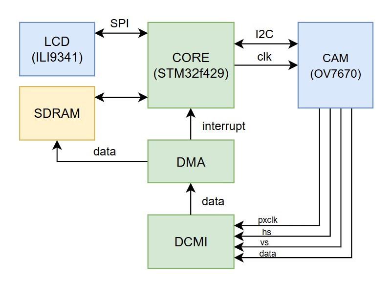
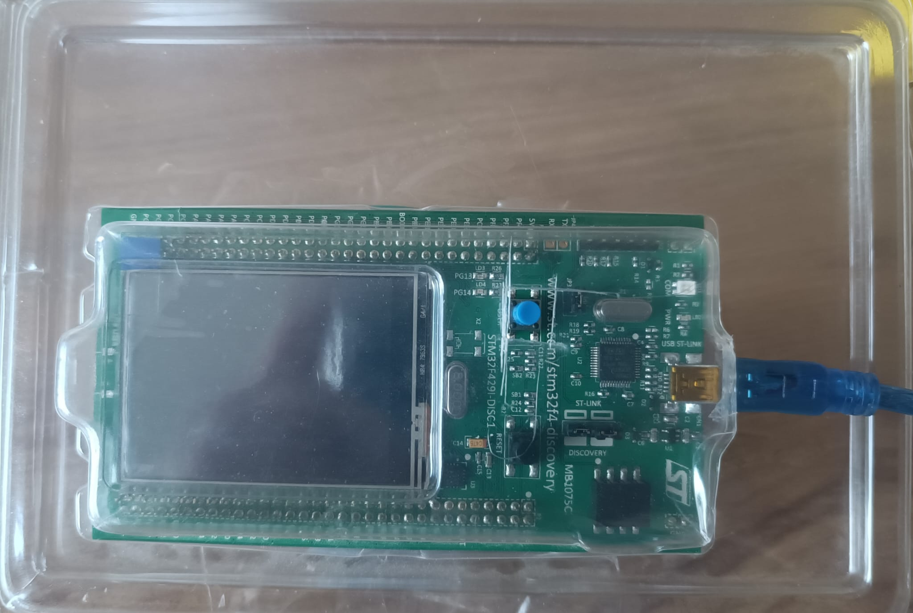
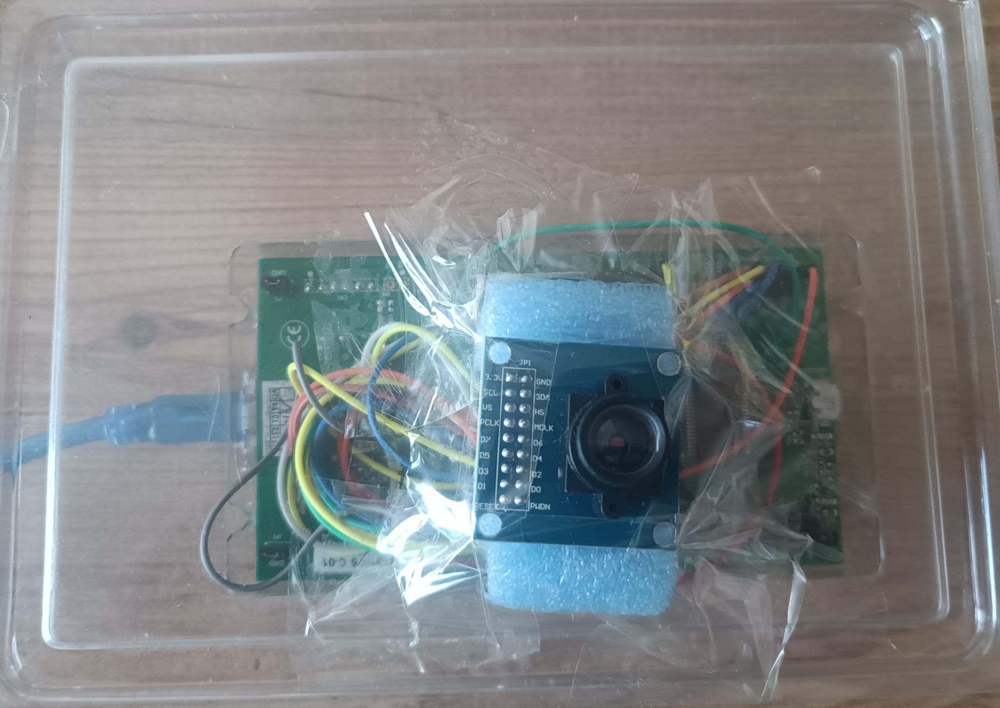

# Project Hardware Details
- [STM32F429 Discovery Board](https://www.st.com/en/evaluation-tools/32f429idiscovery.html)
  - Built-in Touchscreen LCD
- [OV7670 Camera Module](https://www.robotsepeti.com/arduino-kamera-modulu-ov7670)

## Diagram

## Result

## Connections

### DCMI Wiring

| **uC Board** | **OV7670**| 
|--------------|-----------|
| PB7          | VSYNC     |
| PA4          | HS        |	
| PA6          | PCLK      |
| PA8          | XCLK      |
| PE6	         | D7        |
| PE5          | D6        |	
|	PD3          | D5        |
| PE4          | D4        |
| PC9          | D3        |
| PC8          | D2        |
| PC7          | D1        |
| PC6          | D0        |

### SCCB Wiring

| **uC Board** | **OV7670**| 
|--------------|-----------|
| PB8          | SCL       |
| PB9          | SDA       |

### SDRAM Wiring

| **uC Board** | **IS42S16400J**| 
|--------------|-----------|
| PB6          | SDNE1     |
| PB5          | SDCKE1    |	
| PC0          | SDNWE     |	
| PD15         | D1        |
| PD14         | D0        |
| PD10         | D15       |
| PD9          | D14       |
| PD8          | D13       |
| PD1          | D3        |
| PD0	         | D2        |
| PE15         | D12       |
| PE14         | D11       |
| PE13         | D10       |
| PE12         | D9        |
| PE11         | D8        |
| PE10         | D7        |
| PE9          | D6        |
| PE8          | D5        |
| PE7          | D4        |
| PE1          | NBL1      |
| PE0          | NBL0      |
| PF15         | A9        |
| PF14         | A8        |
| PF13         | A7        |
| PF12         | A6        |
| PF11         | SDNRAS    |
| PF5          | A5        |
| PF4          | A4        |
| PF3          | A3        |
| PF2          | A2        |
| PF1          | A1        |
| PF0          | A0        |
| PG15         | SDNCAS    |
| PG8          | SDCLK     |	
|	PG5          | BA1       |
| PG4          | BA0       |
| PG1          | A11       |
| PG0          | A10       |
