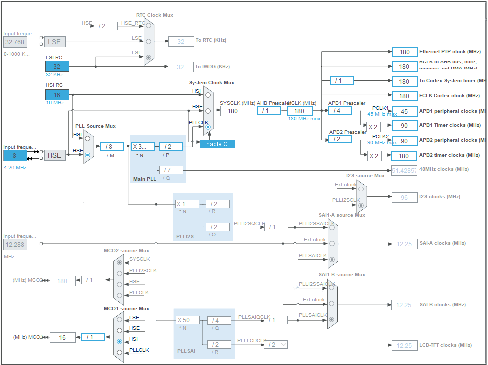

# Software Architecture

## Clock Configuration
Here, in clock configuration HSE[^1], an external clock source is configured and PLL[^2] scalers are to to it possible maximum values. 

## Interfaces
- I2C1 is configured to set Registers of OV7670. 
- SPI5 is configured to drive TFT[^3] LCD[^4] screen.  

[^1]: High-Speed External
[^2]: Phase Locked Loop
[^3]: Thin Transistor Film
[^4]: Liquid Crystal Display

